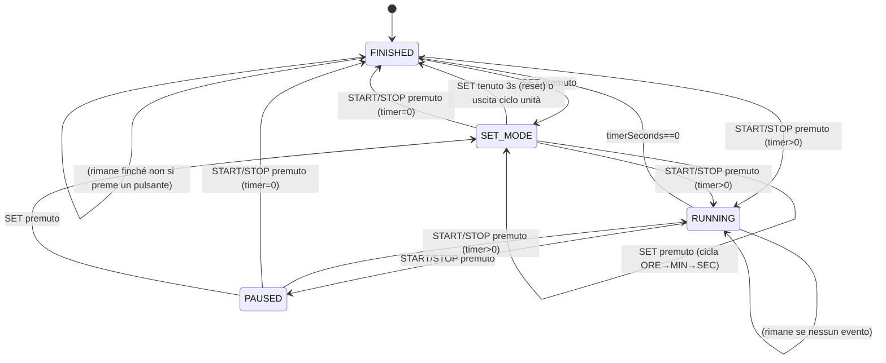

# RetroBox Timer Controller

**RetroBox Timer Controller v1.1** è uno sketch per Arduino che implementa un timer digitale con controllo a relè, progettato per applicazioni come il Retrobright (schiarimento plastica tramite lampade UV), ma facilmente adattabile ad altri scopi dove è necessario attivare un carico per un tempo prestabilito.

## ✨ Funzionalità

- ⏱️ Impostazione del tempo (ore, minuti, secondi) tramite pulsanti
- 🖥️ Visualizzazione su display LCD 16x2 I2C (indirizzo predefinito 0x27)
- 🔁 Funzione START/STOP per far partire o mettere in pausa il timer
- 🔒 Salvataggio automatico del tempo in EEPROM
- ⏫ Modalità di incremento rapido con pressione prolungata dei pulsanti `+` e `-`
- 💡 Lampeggio visivo della cifra modificabile
- 🧠 Logica anti-rimbalzo con libreria Bounce2
- ⚡ Controllo di un modulo relè per attivare/disattivare le lampade UV.

## 🛠️ Requisiti Hardware

- Arduino UNO (o compatibile)
- Display LCD 16x2 con interfaccia I2C (`0x27`)
- 4 pulsanti:
  - `SET`: cambia la cifra da modificare (ore, minuti, secondi)
  - `+` e `-`: aumentano o diminuiscono il valore selezionato
  - `START/STOP`: avvia o mette in pausa il timer
- 1 modulo relè

## 🔌 Collegamenti

| Pin Arduino | Funzione     |
|-------------|--------------|
| D2          | Pulsante `+` |
| D3          | Pulsante `-` |
| D4          | Pulsante `SET` |
| D5          | Pulsante `START/STOP` |
| D6          | Relè         |
| SDA/SCL     | Display I2C  |

## 📦 Librerie Necessarie

Assicurati di installare le seguenti librerie dal Library Manager dell'IDE Arduino:

- `LiquidCrystal_I2C`  
- `r89m PushButton` di [Richard Miles](https://github.com/r89m/PushButton) e relative dipendenze `Bounce2` e `Button`.
    - Le dipendenze sono automaticamente risolte nella versione corretta se installato tramite Library Manager di Arduino IDE.
- `TimerOne`

## 🔧 Modalità di utilizzo

1. Accendi il dispositivo: visualizzerai la schermata iniziale con il tempo salvato in EEPROM.
2. Premi `SET` per entrare nella modalità di configurazione.
3. Usa il tasto `SET` per ciclare tra ore, minuti o secondi e modifica i valori con i tasti `+`/`-`. Tieni premuto per incrementare/decrementare di 10 unità. Dopo tre pressioni su `SET`, esci dalla modalità di impostazione del timer e torna allo stato precedente.
4. Premi `START/STOP` per avviare il timer. Il relè si attiverà per il tempo impostato e il valore impostato sarà salvato nella EEPROM.
5. Puoi mettere in pausa e riprendere in qualsiasi momento.
6. Puoi anche entrare in modalità `SET` quando il Timer è in esecuzione: il relé non verrà disattivato e potrai modificare il valore del Timer con le stesse modalità descritte sopra. 
7. Tieni premuto `SET` per 3 secondi per azzerare il timer (eccetto quando è in esecuzione). Azzerare il Timer non sovrascriverà il valore in EEPROM.

## 🔄 Diagramma degli stati

## TODO

- Aggiungere un feedback sonoro (Buzzer) collegato al PIN 7
- Aggiungere la possibilità di inviare comandi tramite seriale
- Aggiungere una combinazione di comandi per richiamare il tempo salvato in EEPROM senza che sia necessario riavviare il microcontrollore

## 📜 Licenza

Questo progetto è distribuito sotto licenza [MIT](LICENSE).

---

© 2025 Gabriele Baldassarre
