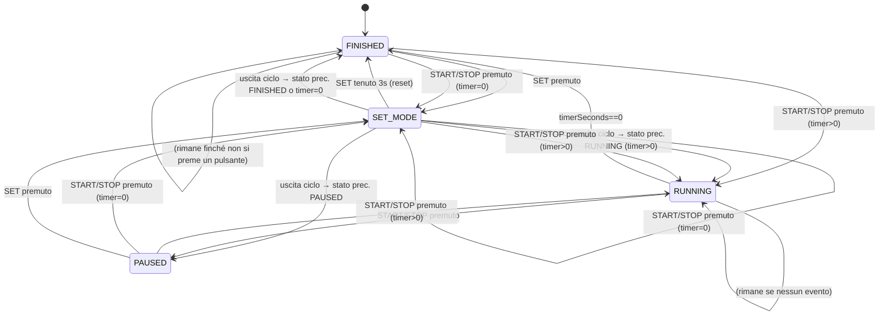

# RetroBox Timer Controller

**RetroBox Timer Controller v1.2** è uno sketch per Arduino che implementa un timer digitale con controllo a relè, progettato per applicazioni come il Retrobright (schiarimento plastica tramite lampade UV), ma facilmente adattabile ad altri scopi dove è necessario attivare un carico per un tempo prestabilito.

## ✨ Funzionalità

- ⏱️ Impostazione del tempo (ore, minuti, secondi) tramite pulsanti
- 🖥️ Visualizzazione su display LCD 16x2 I2C (indirizzo predefinito 0x27)
- 🔁 Funzione START/STOP per far partire o mettere in pausa il timer
- 🔒 Salvataggio automatico del tempo in EEPROM
- ⏫ Modalità di incremento rapido con pressione prolungata dei pulsanti `+` e `-`
- 💡 Lampeggio visivo della cifra modificabile
- 🧠 Logica anti-rimbalzo con libreria Bounce2
- ⚡ Controllo di un modulo relè per attivare/disattivare le lampade UV.

## 🛠️ Requisiti Hardware

- Arduino UNO (o compatibile)
- Display LCD 16x2 con interfaccia I2C (`0x27`)
- 4 pulsanti:
  - `SET`: cambia la cifra da modificare (ore, minuti, secondi)
  - `+` e `-`: aumentano o diminuiscono il valore selezionato
  - `START/STOP`: avvia o mette in pausa il timer
- 1 modulo relè

## 🔌 Collegamenti

| Pin Arduino | Funzione     |
|-------------|--------------|
| D2          | Pulsante `+` |
| D3          | Pulsante `-` |
| D4          | Pulsante `SET` |
| D5          | Pulsante `START/STOP` |
| D6          | Relè         |
| SDA/SCL     | Display I2C  |

## 📦 Librerie Necessarie

Assicurati di installare le seguenti librerie dal Library Manager dell'IDE Arduino:

- `LiquidCrystal I2C` di Marco Schwartz/Frank de Brabander
- `TimerOne` di Paul Stoffregen
- `r89m PushButton` di [Richard Miles](https://github.com/r89m/PushButton), con le dipendenze `r89m Buttons` e `Bounce2` risolte automaticamente.

Le versioni pinnate usate dalla CI sono `LiquidCrystal I2C` 1.1.4, `TimerOne` 1.2, `Bounce2` 2.72, `r89m Buttons` 2.0.1 e `r89m PushButton` 1.0.1. Il comando `make lib-install` installa tutte le librerie necessarie.

## 🔨 Build da riga di comando

Prerequisiti:

- `arduino-cli` — su macOS puoi installarlo con `brew install arduino-cli`, oppure usare l'[installer ufficiale](https://arduino.github.io/arduino-cli/latest/installation/).
- Esegui `make setup` per installare il core `arduino:avr` e tutte le librerie del progetto.

Il `Makefile` usa `arduino:avr:uno` come FQBN e rileva automaticamente la porta seriale. I target disponibili sono:

| Target | Descrizione |
|--------|-------------|
| ❓ `make help` | Mostra l'aiuto (target predefinito) |
| ✅ `make check-cli` | Verifica la presenza di `arduino-cli` |
| 🔨 `make compile` | Compila lo sketch |
| 🔁 `make all` | Alias di `compile` |
| 📤 `make upload` | Compila e carica lo sketch sulla scheda |
| 📺 `make monitor` | Avvia il monitor seriale |
| 🧹 `make clean` | Rimuove gli artefatti di compilazione |
| 📚 `make lib-install` | Installa le librerie necessarie |
| 🚀 `make setup` | Installa core Arduino e librerie |

Per usare una porta specifica invece di quella rilevata automaticamente:

```bash
make upload PORT=/dev/cu.usbmodemXXXX
```

## 🔧 Modalità di utilizzo

1. Accendi il dispositivo: visualizzerai la schermata iniziale con il tempo salvato in EEPROM.
2. Premi `SET` per entrare nella modalità di configurazione.
3. Usa il tasto `SET` per ciclare tra ore, minuti o secondi e modifica i valori con i tasti `+`/`-`. Tieni premuto per incrementare/decrementare di 10 unità. Dopo tre pressioni su `SET`, esci dalla modalità di impostazione del timer e torna allo stato precedente.
4. Premi `START/STOP` per avviare il timer. Il relè si attiverà per il tempo impostato e il valore impostato sarà salvato nella EEPROM.
5. Puoi mettere in pausa e riprendere in qualsiasi momento.
6. Puoi anche entrare in modalità `SET` quando il Timer è in esecuzione: il relé non verrà disattivato e potrai modificare il valore del Timer con le stesse modalità descritte sopra. 
7. Tieni premuto `SET` per 3 secondi per azzerare il timer (eccetto quando è in esecuzione). Azzerare il Timer non sovrascriverà il valore in EEPROM.

## 🔄 Diagramma degli stati



## 🧪 CI/CD


GitHub Actions esegue `compile --warnings all` su ogni push e pull request, pubblica l'artefatto `.hex` e include un job di test **compile-only**. L'esecuzione dei test automatizzati con simavr è pianificata.

## 💻 Sviluppo in VS Code

Apri `retrobox-arduino-timer.code-workspace` per usare la configurazione multi-root del progetto. Le cartelle sono organizzate con etichette emoji: `⏱️ Firmware`, `⚙️ Config`, `🔧 CI` e `📦 root`.

Sono disponibili i task `🔨 Build`, `📤 Upload`, `🧹 Clean`, `📺 Monitor`, `📚 Installa librerie` e `🚀 Setup iniziale`. Le estensioni consigliate includono C/C++ (`cpptools`), EditorConfig, Markdownlint e GitHub Actions.

## 🐛 Note tecniche (v1.2)

- L'ISR di Timer1 è minimale: aggiorna solo flag/tick, lasciando I2C, display e Serial al ciclo principale.
- Gli accessi a `timerSeconds` (32 bit su AVR a 8 bit) sono protetti con `ATOMIC_BLOCK`.
- La classe `String` è stata rimossa in favore di buffer `char` statici e `snprintf`, evitando frammentazione dell'heap.
- Il tempo in EEPROM è validato con magic byte `0xAB12` e limitato a un massimo di 24 ore.
- Il watchdog AVR da 2 s, il timeout I2C e i `pinMode` espliciti con `INPUT_PULLUP` migliorano robustezza e prevedibilità dell'hardware.
- Il hold-repeat usa il wrap modulare corretto per ore, minuti e secondi; è stato corretto anche l'overflow `int16` nel calcolo delle ore.

## TODO

- Aggiungere un feedback sonoro (Buzzer) collegato al PIN 7
- Aggiungere la possibilità di inviare comandi tramite seriale
- Aggiungere una combinazione di comandi per richiamare il tempo salvato in EEPROM senza che sia necessario riavviare il microcontrollore

## 📜 Licenza

Questo progetto è distribuito sotto licenza [MIT](LICENSE).

---

© 2025-2026 Gabriele Baldassarre
